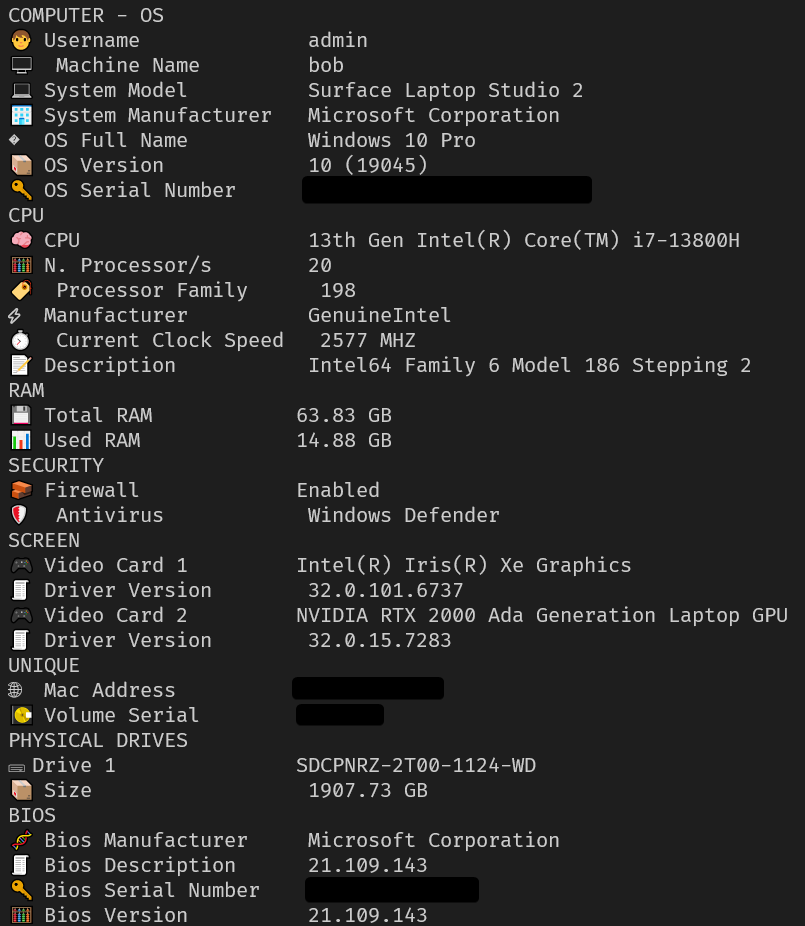

# System Information

A fast, modern system information tool for Windows, built in Rust.  
Displays CPU, RAM, BIOS, GPU, disk, OS, security, and network identifiers in a clean and emoji-enhanced CLI layout.



---

## ✨ Features

- 🔍 Detailed hardware info (CPU, RAM, Disk, GPU, BIOS)
- 🛡️ Security status (Firewall & Antivirus detection)
- 💻 System model, manufacturer, OS version & serial
- 🧠 Fully async architecture using `tokio` for performance
- ⚙️ Windows-only WMI support via `wmi` crate
- 📡 MAC address and volume serial as unique identifiers
- 📦 Minimal dependencies, fast and clean output

---

## 🚀 Requirements

- Windows 10 or later
- [Rust](https://rust-lang.org/tools/install)

---

## 🛠 Installation

```bash
git clone https://github.com/pathetic/system-information
cd system-information
cargo build --release
```
